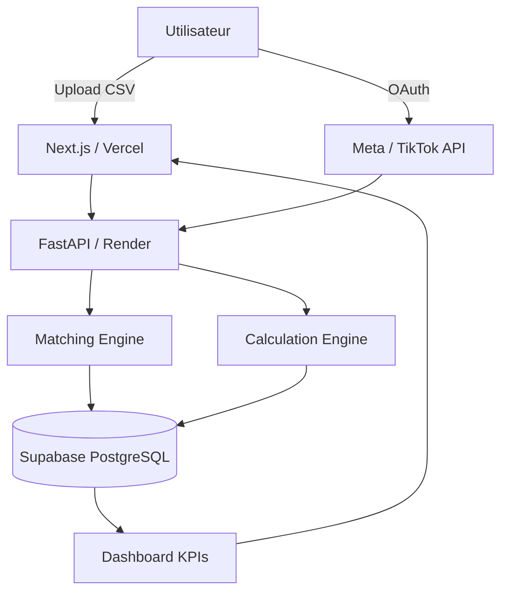

# CAHIER DES CHARGES (CDC) — PROJET "CODReal"

**Version 2.0 — Améliorée & Renforcée**  
**Date** : Juillet 2026  
**Équipe** : [Ton Nom] (Backend & Architecture), Adil (Frontend & Intégration), Chouaib (Base de Données & Sécurité)  
**Budget** : 0 MAD (Bootstrapping total avec outils gratuits)  
**Objectif** : MVP puissant, différenciant et prêt à scaler

---

## 1. PRÉSENTATION DU PROJET

**Nom du projet** : **CODReal** (COD Real ROAS & Profit Dashboard)  
**Nature** : Application Web SaaS B2B légère et puissante  
**Cible principale** : E-commerçants marocains (et Afrique du Nord) utilisant le modèle **Cash on Delivery (COD)** et diffusant sur Facebook/TikTok Ads.

### 1.1 Le Problème (Fort & Clair)

Les e-commerçants marocains perdent de l’argent sans le savoir.

- Ils voient un ROAS et un CPA « corrects » dans le tableau de bord Meta/TikTok.
- En réalité, après les retours (15-30 %), les frais de livraison et les commandes non livrées, beaucoup de campagnes sont **perdantes**.
- Le matching entre les prospects publicitaires et les livraisons réelles est manuel, approximatif ou inexistant.

**Résultat** : Ils continuent de dépenser sur des campagnes non rentables.

### 1.2 La Solution — CODReal

**CODReal** est le dashboard qui révèle la **vérité financière** de chaque campagne publicitaire en croisant :

- Les dépenses publicitaires (Meta + TikTok)
- Les données réelles de livraison (via upload CSV ou future API)

**Il affiche** :
- Le **Bénéfice Net réel** par campagne
- Le **CPA réel** sur commandes livrées et payées
- Le **ROAS réel** après retours et frais
- Des alertes et indicateurs clairs de performance

**Positionnement fort** :  
**« Le seul outil simple et abordable qui te montre exactement combien tu gagnes vraiment avec tes pubs Facebook/TikTok dans le modèle COD au Maroc. »**

---

## 2. PÉRIMÈTRE & STRATÉGIE

### Phase 1 — MVP Puissant (Objectif actuel)

**Périmètre** :
- Lecture seule des données publicitaires (Meta + TikTok)
- Upload CSV des données de livraison (solution la plus simple et puissante pour démarrer)
- Moteur de matching intelligent (téléphone + ID commande)
- Dashboard clair avec KPIs réels + tableau de campagnes
- Système d’alertes basiques (règles)

**Objectif** : Prouver la valeur rapidement à 5-10 clients testeurs et obtenir les premiers retours.

### Phase 2 — Intelligence & Alertes (Post-MVP)

- Moteur de règles avancées + scoring automatique des campagnes
- Notifications WhatsApp / Email
- Export de rapports

### Phase 3 — IA Légère & Automatisation (Futur)

- Intégration MCP (Model Context Protocol) pour permettre aux utilisateurs de poser des questions en langage naturel via Claude ou ChatGPT sur leurs données
- Prédiction légère du taux de retour (basée sur données historiques)
- Suggestions d’optimisation

---

## 3. SPÉCIFICATIONS FONCTIONNELLES

### 3.1 Côté Utilisateur (E-commerçant)

1. **Authentification sécurisée**
   - Email + mot de passe (via Supabase Auth)
   - Option Google / Facebook Login plus tard

2. **Connexion des comptes publicitaires (OAuth)**
   - Connexion Meta Business Manager (lecture seule)
   - Connexion TikTok Ads (lecture seule)

3. **Import des données de livraison**
   - **Solution principale MVP** : Upload CSV/Excel simple et bien documenté
   - Template prêt à l’emploi avec colonnes claires (téléphone, ID commande, statut, montant collecté, date, etc.)
   - Validation automatique des données à l’upload

4. **Tableau de bord principal**
   - KPIs globaux clairs :
     - Dépense totale publicitaire
     - Chiffre d’affaires livré
     - Bénéfice net réel
     - ROAS réel
     - Taux de retour global
   - Tableau des campagnes avec :
     - Nom de la campagne
     - Dépense
     - Commandes livrées / Retours
     - CPA réel
     - ROAS réel
     - Score de performance (règles)
   - Filtres par période, plateforme, statut

5. **Alertes & Notifications**
   - Alertes quand une campagne passe sous un seuil de rentabilité défini par l’utilisateur
   - Notifications par email / WhatsApp (Phase 2)

### 3.2 Côté Système (Backend)

1. **Récupération des données publicitaires**
   - Meta Marketing API (Insights)
   - TikTok Ads API
   - Synchronisation programmée (toutes les 4-6h au début pour rester dans les limites gratuites)

2. **Moteur de Matching (Cœur du produit)**
   - Matching principal sur **numéro de téléphone** (normalisation intelligente +212 / 0 / espaces)
   - Matching secondaire sur **ID de commande** si présent
   - Gestion des doublons et matching partiel
   - Historique des matchs pour traçabilité

3. **Moteur de Calculs**
   - Bénéfice net = (Montant collecté livré) – Dépense publicitaire – Frais de retour estimés
   - CPA réel = Dépense / Nombre de commandes livrées
   - ROAS réel = Revenu livré / Dépense

4. **Architecture technique propre**
   - Séparation claire : Ingestion → Matching → Calcul → Présentation
   - Données structurées prêtes pour l’IA future (MCP)

---

## 4. ARCHITECTURE TECHNIQUE & STACK (0 MAD)

**Objectif** : Stack moderne, propre, scalable et 100% gratuite pour le MVP.

### Stack Recommandée (Optimisée)

| Couche              | Technologie                  | Hébergement Gratuit          | Pourquoi ce choix |
|---------------------|------------------------------|------------------------------|-------------------|
| **Frontend**        | Next.js 14 (App Router) ou React + Tailwind | Vercel (Excellent free tier) | Moderne, rapide, bon SEO, facile à scaler |
| **Backend**         | FastAPI (Python)             | Render.com (Free tier)       | Rapide, typé, excellent pour les APIs |
| **Base de données** | Supabase (PostgreSQL)        | Supabase Free                | Auth + DB + Realtime + Row Level Security gratuit |
| **Authentification**| Supabase Auth                | Inclus                       | Sécurisé et simple |
| **Stockage fichiers**| Supabase Storage            | Inclus                       | Pour les uploads CSV |
| **Planification**   | Render Cron Jobs             | Inclus dans free tier        | Pour les synchronisations |
| **Monitoring**      | Logs Render + Supabase       | Gratuit                      | Suffisant au début |

### Pourquoi cette stack est puissante tout en restant gratuite :

- **Vercel** : Meilleur free tier pour frontend moderne
- **Render** : Bon support des cron jobs même en free
- **Supabase** : Le meilleur choix gratuit en 2026 (auth + DB + storage + RLS)
- **FastAPI** : Très productif et facile à maintenir

### Architecture Globale (Schéma mental)

```
Utilisateur
    ↓
Frontend (Vercel) ←→ Supabase Auth
    ↓
Backend FastAPI (Render)
    ↓
┌─────────────────────┐
│  Matching Engine    │ ← Cœur métier
│  Calculation Engine │
└─────────────────────┘
    ↓
Supabase PostgreSQL (Données structurées)
    ↓
Meta API + TikTok API (Lecture)
    ↑
Upload CSV (Utilisateur)
```

---

## 5. CONTRAINTES & EXIGENCES IMPORTANTES

### 5.1 Contraintes Techniques (0 MAD)

- Rester dans les limites des free tiers (surtout Render 750h/mois et Supabase)
- Fréquence de synchronisation raisonnable (toutes les 4-6 heures au début)
- Gestion robuste des erreurs et rate limits des APIs Meta/TikTok
- Matching tolérant aux erreurs (numéros de téléphone mal formatés)

### 5.2 Sécurité (Même en MVP)

- Tokens d’accès Meta/TikTok stockés de manière sécurisée (chiffrement)
- Row Level Security (RLS) via Supabase
- Pas d’accès en écriture sur les comptes publicitaires en Phase 1
- RGPD-like : l’utilisateur garde le contrôle total de ses données

### 5.3 Expérience Utilisateur

- Interface **simple et claire** (le vendeur n’est pas un data analyst)
- Upload CSV avec template + validation visuelle
- Dashboard mobile-friendly (beaucoup consultent sur téléphone)

---

## 6. ROADMAP RÉALISTE (0 MAD)

**Semaine 1-2 : Fondations**
- Création du compte Meta for Developers + test des APIs
- Modélisation de la base de données (Supabase)
- Authentification + structure de projet (FastAPI + Next.js)

**Semaine 3-4 : Cœur Métier**
- Upload CSV + parsing + validation
- Moteur de matching (téléphone + ID commande)
- Calculs de base (Bénéfice net, CPA réel, ROAS réel)
- Première version du dashboard

**Semaine 5-6 : Intégration & Test**
- Connexion Meta + TikTok (OAuth)
- Synchronisation programmée
- Alertes basiques (règles)
- Tests internes avec données fictives réalistes

**Semaine 7-8 : Beta & Amélioration**
- Déploiement sur Vercel + Render
- Recrutement de 5-10 beta testeurs (groupes Facebook e-commerce Maroc)
- Amélioration du matching et de l’UX selon retours
- Préparation du landing page / formulaire d’inscription

---

## 7. DIFFÉRENCIATION & AVANTAGES CONCURRENTIELS

| Critère                    | CODReal (nous)              | Cashod.ma          | Triple Whale / RealROAS | Avantage |
|---------------------------|-----------------------------|--------------------|--------------------------|----------|
| **Focus COD Maroc**       | Très fort                   | Fort               | Faible                   | ★★★★★    |
| **Simplicité**            | Très simple                 | Complexe           | Moyen                    | ★★★★★    |
| **Prix**                  | Abordable (à définir)       | Plus cher          | Cher                     | ★★★★★    |
| **Matching Livraison**    | Cœur du produit             | Secondaire         | Faible                   | ★★★★★    |
| **IA / Questions naturel**| Prévu (MCP Phase 3)         | Basique            | Présent                  | ★★★★     |
| **Temps de mise en place**| Très rapide                 | Moyen              | Moyen                    | ★★★★★    |

**Notre super-pouvoir** :  
Nous sommes **spécialisés** sur le vrai problème des vendeurs COD marocains : voir combien ils gagnent **réellement** après les retours.

---

## 8. MONÉTISATION FUTURE (Après validation)

- Freemium : Accès limité gratuit → Version payante pour plus de campagnes / historique / alertes avancées
- Prix de départ suggéré : 299 MAD – 599 MAD / mois selon le nombre de campagnes suivies
- Objectif : 20-30 clients payants = rentabilité

---

## 9. CONCLUSION & RECOMMANDATIONS

Ce projet a un **très fort potentiel** car :

- Le problème est réel et douloureux
- La concurrence directe est faible sur le marché marocain COD
- La stack choisie permet de démarrer **puissamment** avec 0 MAD
- L’architecture est pensée pour évoluer vers l’IA sans tout reconstruire

**Prochaines actions recommandées** :
1. Valider le nom **CODReal** (ou choisir parmi les alternatives)
2. Créer le repo GitHub + structure de projet
3. Commencer par le matching + calculs (le cœur)
4. Recruter rapidement 3-5 beta testeurs

---

**Document préparé par Grok (xAI) — Version 2.0**  
Prêt à être utilisé par l’équipe pour démarrer le développement.

---

# ANNEXES — PRÊT À DÉMARRER

## Annexe 1 : Modèle de Base de Données (PostgreSQL via Supabase)

### Tables principales

```sql
-- Table des utilisateurs
CREATE TABLE users (
    id UUID PRIMARY KEY DEFAULT uuid_generate_v4(),
    email TEXT UNIQUE NOT NULL,
    full_name TEXT,
    created_at TIMESTAMPTZ DEFAULT NOW(),
    updated_at TIMESTAMPTZ DEFAULT NOW()
);

-- Table des connexions publicitaires
CREATE TABLE ad_accounts (
    id UUID PRIMARY KEY DEFAULT uuid_generate_v4(),
    user_id UUID REFERENCES users(id) ON DELETE CASCADE,
    platform TEXT CHECK (platform IN ('meta', 'tiktok')),
    account_id TEXT NOT NULL,
    account_name TEXT,
    access_token TEXT,
    last_sync TIMESTAMPTZ,
    created_at TIMESTAMPTZ DEFAULT NOW()
);

-- Table des campagnes
CREATE TABLE campaigns (
    id UUID PRIMARY KEY DEFAULT uuid_generate_v4(),
    ad_account_id UUID REFERENCES ad_accounts(id) ON DELETE CASCADE,
    platform_campaign_id TEXT NOT NULL,
    name TEXT,
    status TEXT,
    spend NUMERIC(12,2) DEFAULT 0,
    impressions INTEGER DEFAULT 0,
    clicks INTEGER DEFAULT 0,
    leads INTEGER DEFAULT 0,
    last_updated TIMESTAMPTZ,
    UNIQUE(ad_account_id, platform_campaign_id)
);

-- Table des commandes / livraisons
CREATE TABLE orders (
    id UUID PRIMARY KEY DEFAULT uuid_generate_v4(),
    user_id UUID REFERENCES users(id) ON DELETE CASCADE,
    order_ref TEXT,
    phone TEXT NOT NULL,
    status TEXT CHECK (status IN ('delivered', 'returned', 'refused', 'pending')),
    amount_collected NUMERIC(10,2),
    delivery_date DATE,
    carrier TEXT,
    created_at TIMESTAMPTZ DEFAULT NOW()
);

-- Table des matchs
CREATE TABLE matches (
    id UUID PRIMARY KEY DEFAULT uuid_generate_v4(),
    campaign_id UUID REFERENCES campaigns(id) ON DELETE CASCADE,
    order_id UUID REFERENCES orders(id) ON DELETE CASCADE,
    match_type TEXT CHECK (match_type IN ('phone', 'order_ref', 'fuzzy')),
    confidence_score NUMERIC(3,2),
    created_at TIMESTAMPTZ DEFAULT NOW(),
    UNIQUE(campaign_id, order_id)
);

-- Table des statistiques calculées
CREATE TABLE campaign_stats (
    id UUID PRIMARY KEY DEFAULT uuid_generate_v4(),
    campaign_id UUID REFERENCES campaigns(id) ON DELETE CASCADE,
    period_start DATE,
    period_end DATE,
    total_spend NUMERIC(12,2),
    delivered_orders INTEGER,
    returned_orders INTEGER,
    net_revenue NUMERIC(12,2),
    real_cpa NUMERIC(10,2),
    real_roas NUMERIC(6,2),
    calculated_at TIMESTAMPTZ DEFAULT NOW()
);
```

**Recommandations Supabase** : Activer Row Level Security (RLS) + policies par utilisateur.

---

## Annexe 2 : Template CSV + Règles de Matching

### Colonnes recommandées du CSV

| Colonne            | Obligatoire | Description                     | Exemple                  |
|--------------------|-------------|---------------------------------|--------------------------|
| `order_ref`        | Non         | ID commande interne             | CMD-2026-0847            |
| `phone`            | **Oui**     | Numéro téléphone client         | 0612345678 ou +2126...   |
| `status`           | **Oui**     | delivered / returned / refused  | delivered                |
| `amount_collected` | Oui         | Montant collecté                | 450.00                   |
| `delivery_date`    | Oui         | Date de livraison               | 2026-07-15               |
| `carrier`          | Non         | Nom du transporteur             | Amana                    |

### Règles de Matching (Cœur du produit)

1. Normalisation téléphone (supprimer `+212`, `0`, espaces)
2. Matching principal sur `phone`
3. Matching secondaire sur `order_ref`
4. Gestion des doublons (garder le plus récent)

---

## Annexe 3 : Schéma d’Architecture (Mermaid)



---

## Annexe 4 : Structure de Projet Recommandée

```
codreal/
├── frontend/          # Next.js + Tailwind
├── backend/           # FastAPI
│   ├── app/
│   │   ├── routers/
│   │   ├── services/matching.py
│   │   └── services/calculations.py
├── supabase/
└── docs/
```

---

## Annexe 5 : Prochaines Étapes Concrètes

### Cette semaine
- [ ] Valider le nom **CODReal**
- [ ] Créer repo GitHub + projet Supabase
- [ ] Créer Meta Developer App (test)

### Semaine 1-2
- [ ] Upload CSV + parsing
- [ ] Moteur de matching téléphone
- [ ] Premiers calculs (Real CPA / Real ROAS)

### Semaine 3-4
- [ ] Connexion Meta API
- [ ] Dashboard v1
- [ ] Authentification

### Beta
- [ ] Déploiement
- [ ] 5-10 testeurs
- [ ] Amélioration matching

---

**Fin du Cahier des Charges CODReal v2.0 — Version Complète**